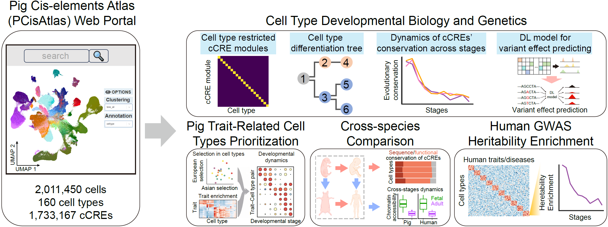

## Analysis pipelines for the Pig *Cis*-elements Atlas (PCisAtlas)

### 1. Introduction

As part of the international Farm animal Genotype-Tissue Expression ([FarmGTEx](https://www.farmgtex.org/)) project, we present the Pig *Cis*-elements Atlas ([PCisAtlas](https://PCisAtlas.farmgtex.org/)), a comprehensive single-cell chromatin accessibility landscape across 55 pig tissues spanning 12 developmental stages from early embryogenesis to adulthood. This resource encompasses approximately 2 million nuclei, systematically annotating 160 distinct cell types and 1.73 million candidate *cis*-regulatory elements (cCREs). Leveraging PCisAtlas, we reconstructed cell differentiation trajectories, uncovered key regulatory programs active during pig development, and developed deep-learning models to predict cell- and stage-specific regulatory impacts of genomic variants. By integrating this atlas with whole-genome resequencing data from 1,102 pigs and GWAS data for 132 complex traits, we demonstrate that independent Asian and European domestication trajectories targeted distinct cellular lineages across specific developmental windows to functionally shape complex traits. Cross-species comparisons with mouse snATAC-seq data and human fetal and adult cells reveal the domain-specific advantages of the pig over rodents in capturing human metabolic and immunological heritability, while the 12-stage resolution highlights critical developmental windows often missed in adult-centric studies. Collectively, PCisAtlas provides a developmentally resolved, single-cell resolution resource for dissecting complex trait genetics, contributing to pig precision breeding and human health.

---

### 2. Pipeline Overview

This repository contains the complete analysis pipeline for the PCisAtlas project, organized into six stages:

| Stage | Directory | Description |
|-------|-----------|-------------|
| 1 | `01.fastq_process` | Raw FASTQ demultiplexing, read mapping, fragment generation and QC |
| 2 | `02.initialize_ArchR` | ArchR project initialization, LSI dimensionality reduction, Harmony batch correction, clustering, peak calling |
| 3 | `03.NMF_analysis` | Identification of cCRE modules using non-negative matrix factorization (NMF) |
| 4 | `04.cell_state_transition_tree` | Construction of cell state transition trees across developmental stages |
| 5 | `05.GWAS_enrichment` | Pig GWAS enrichment (scPagwas and qgg Tsum) and human/mouse LDSC enrichment (247 traits, 3-species comparison) |
| 6 | `06.pig_human_integration` | Cross-species co-embedding (adult + fetal), conserved CRE identification, developmental diff peak comparison |

---

### 3. Table of Contents by Stage

#### Stage 1: `01.fastq_process/`
> Processing of raw FASTQ files, including demultiplexing, read mapping and filtering, and the generation and filtering of fragment/metadata files. Includes a demo dataset for testing.

**Scripts:**
- `01.demultiplex_fastq.sh` — Job submission wrapper for demultiplexing raw sequencing data (calls `get_fixed.fq.indel.pl`)
- `02.fastq2fragment.sh` — FASTQ filtering, alignment (bwa), fragment generation and reformatting
- `fragment.qc.{1-4}.pl` — Fragment-level QC filters: fragments length < 1000, remove MT reads, fragments count > 1000 & < 100000, TSS enrichment > 2, etc.
- `preprocess_barcodes.indel.pl` / `get_fixed.fq.indel.pl` — Barcode error correction and demultiplexing of raw sequencing data
- `snapatac2.tsse.py` — TSS enrichment calculation via SnapATAC2
- `QC.plot.r` / `QC.plot.fraglen.r` / `Stat.fragments.r` — QC visualization and statistics

#### Stage 2: `02.initialize_ArchR/`
> Basic workflow for initializing the ArchR project, performing cell clustering and visualization, and calling peaks.

**Scripts:**
- `01.create_ArchR_object.r` — Initialize ArchR project from Arrow files with pig genome annotations
- `02.initially_clustering.r` — Iterative LSI → Harmony batch correction (by `Date_Tissue`) → UMAP visualization
- `03.call_peaks.r` — Peak calling with MACS2 via `addReproduciblePeakSet`

**Dependencies:** `BSgenome.Sscrofa.UCSC.susScr11`, `TxDb.Sscrofa.Ensembl.susScr11.V1`, `org.Spig.eg.db`

#### Stage 3: `03.NMF_analysis/`
> Identification of cCRE modules using non-negative matrix factorization (NMF).

**Reference:** [yal054/snATACutils](https://github.com/yal054/snATACutils/tree/master/04.peak_analysis)

#### Stage 4: `04.cell_state_transition_tree/`
> Construction of cell state transition trees from single-cell chromatin accessibility data.

**Scripts:**
- `usage_function.r` — Core functions for cell state transition tree construction:
  - `Subway_map.step_1.UMAP_list.seurat()` — Generate pairwise co-embedding UMAPs (Signac) for adjacent developmental stages
  - `Subway_map.step_2.knn_list()` — Compute KNN-based edge weights between cell types across stages (500 bootstrap replicates)
  - `Subway_map.step_3.knn_res()` — Filter edges (default cutoff: 0.25) and generate tree structure
  - `Subway_map.step_4.plot_tree()` — Plot developmental trees as D3.js interactive HTML
  - `Subway_map.step_4.plot_heatmap()` — Plot edge weight heatmaps for each adjacent stage pair
- `01.tree_with_signac.r` — Example workflow demonstrating the complete tree construction pipeline

Based on methods from [TOME](https://github.com/ChengxiangQiu/tome_code).

#### Stage 5: `05.GWAS_enrichment/`
> Enrichment analysis of pig and human GWAS signals in cCREs.

**Scripts:**
- `01.selection_sweep_enrichment.r` — Selection sweep enrichment analysis: LOLA enrichment of selection signatures in cell-type cCRE modules, selection prediction heatmaps
- `02.GWAS_enrichment.r` — Pig GWAS enrichment using scPagwas (cell type and cell lineage levels, KEGG pathway PCA) and qgg Tsum (permutation test for selection-overlapped regions)
- `02.human_GWAS.LDSC.sh` — Human GWAS enrichment using stratified LD score regression (LDSC), with pig-to-human liftover of cCRE coordinates

#### Stage 6: `06.pig_human_integration/`
> Cross-species integration of single-cell chromatin accessibility data from pig and human.

**Scripts:**
- `coembedding.r` — Pig-human co-embedding analysis: subset to shared cell types (30 cell types, 16 tissues at 180d), generate pseudo-bulk peak matrices, liftover coordinates, and integrate with Seurat/Signac
- `coembedding_detailed.r` — **Detailed downstream analysis** : adult + fetal co-embedding, conserved CRE (1000-iteration liftover random sampling), 180d vs E43 diff peaks with human CPM comparison, diff peak motif enrichment

### 4. System Requirements

**Operating System:** Linux (tested on CentOS 7/8)

**Key Software Dependencies:**
- R ≥ 4.x with BioConductor
- [ArchR](https://www.archrproject.com/) — primary scATAC-seq framework
- [Seurat](https://satijalab.org/seurat/) / [Signac](https://stuartlab.org/signac/) — single-cell analysis
- BWA — read alignment
- MACS2 — peak calling
- bedtools — genomic interval operations
- [HOMER](http://homer.ucsd.edu/homer/) — motif enrichment
- FIMO (MEME suite) — motif scanning
- liftOver (UCSC) — cross-species coordinate mapping
- Python 3.x with SnapATAC2

**R Packages:** See `02.initialize_ArchR/r_packages_version.txt` and `02.initialize_ArchR/environment_list.txt`.

**Pig Reference Genome:** Sscrofa11.1 (`BSgenome.Sscrofa.UCSC.susScr11`, `TxDb.Sscrofa.Ensembl.susScr11.V1`, `org.Spig.eg.db`)

---

### 5. Citation

**Pending...** (manuscript in revision)
